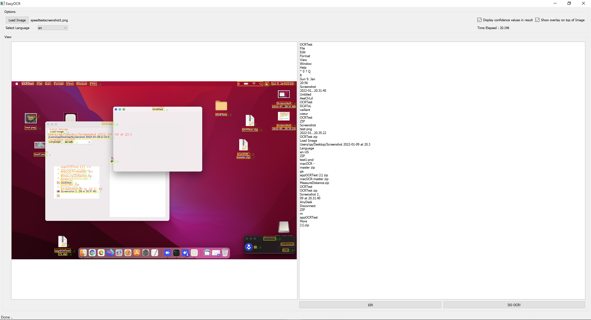

# EasyOCR_GUI
This Project Packs EasyOCR Libaray in PyQt5 GUI

# Quickstart

* Install "anaconda" or "miniconda" 

* From anaconda terminal: create an environment using the "environment.yaml" file

   ---> In Anaconda terminal : conda env create -n /your/env/name> -f environment.yaml

   ---> Please replace your/env/name with a desired name for your environment.

* Activate environment by running the command "conda activate your/env/name" on anaconda command prompt

* Finally, run "python main_ocr.py" to run the app
